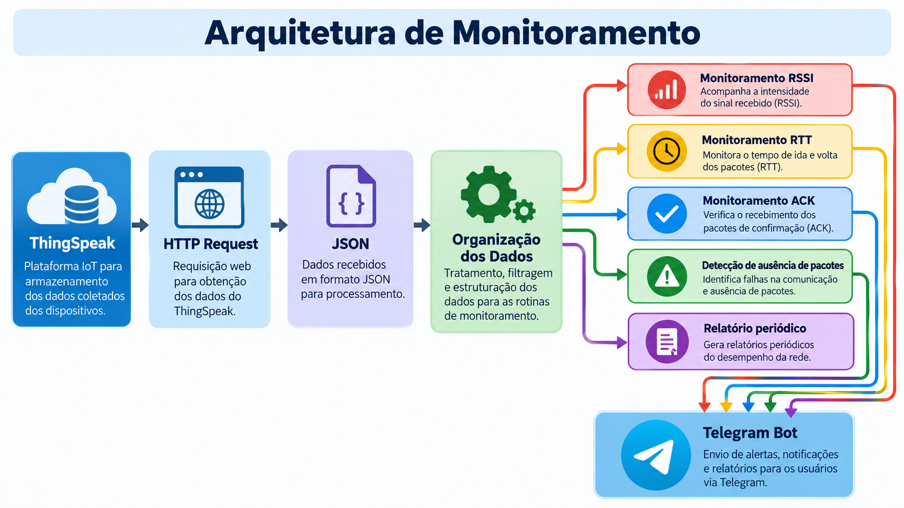

# Supervisão de Enlace Wi-Fi com Node-RED e Telegram

Este projeto implementa uma camada de supervisão para uma bancada experimental de comunicação Wi-Fi baseada em ESP32.

Os dados da bancada são armazenados no ThingSpeak e consultados periodicamente pelo Node-RED. O fluxo realiza o tratamento das informações e executa rotinas independentes de monitoramento para detectar condições anormais no enlace.

As principais variáveis supervisionadas são:

- RSSI, para acompanhamento da intensidade do sinal recebido;
- RTT, para avaliação da latência da comunicação;
- ACK, para verificação da confirmação de recebimento dos pacotes;
- ausência de novos pacotes por período superior a 3 minutos;
- temperatura e umidade provenientes do sensor DHT11;
- distância estimada;
- número sequencial do pacote.

Quando uma condição anormal é identificada, o Node-RED gera automaticamente uma mensagem e a encaminha para o usuário por meio de um bot do Telegram.

O sistema também envia relatórios periódicos com os valores atuais das principais variáveis monitoradas.

## Arquitetura do Sistema - 02

  

  <em>Figura 1 – Arquitetura de monitoramento baseada em ThingSpeak, Node-RED e Telegram.</em>

## Arquitetura do Sistema - 04

## Arquitetura

ThingSpeak
    |
    v
HTTP Request
    |
    v
JSON
    |
    v
Organização dos Dados
    |
    +--> Monitoramento RSSI
    |
    +--> Monitoramento RTT
    |
    +--> Monitoramento ACK
    |
    +--> Detecção de ausência de pacotes
    |
    +--> Relatório periódico
    |
    v
Telegram Bot

## Funcionalidades

- Consulta automática ao ThingSpeak;
- organização dos dados recebidos;
- detecção de RSSI abaixo do limite;
- detecção de RTT elevado;
- identificação de falhas de ACK;
- detecção de ausência de novos pacotes;
- controle de estado para evitar mensagens repetitivas;
- envio de mensagens de normalização;
- envio de relatórios periódicos;
- depuração dos dados pelo nó Debug;
- envio remoto de alertas pelo Telegram.

## Tecnologias utilizadas

- ESP32;
- DHT11;
- Wi-Fi 2,4 GHz;
- ThingSpeak;
- Node-RED;
- Telegram Bot.

## Objetivo

O objetivo do projeto é acrescentar uma camada de supervisão automática a uma bancada experimental de enlace Wi-Fi utilizando ferramentas de baixo custo e software acessível.

A solução permite acompanhar remotamente o funcionamento do enlace e receber notificações apenas quando ocorrerem mudanças relevantes no estado das variáveis monitoradas.
